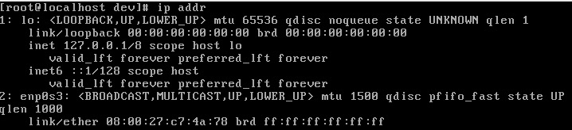

# CentOs 7 ifconfig：Command not Found

 * 在sbin目录中没有ifconfig文件，这是因为centos7已经不使用 ifconfig命令了，已经用ip命令代替
 * 解决方案：yum install net-tools
  
# CentOs 7 不能联网问题

    通过ip addr来查看
    

    发现网卡没有被激活
    
    vi /etc/sysconfig/network-scripts/ifcfg-enp0s3 编辑次网卡，将ONBOOT=no 修改为 ONBOOT=yes
    
    重启网卡（service network restart)，在ping www.baidu.com 问题结局
 
